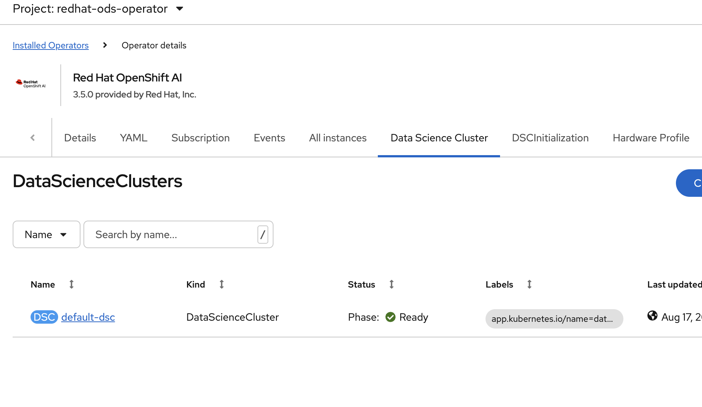
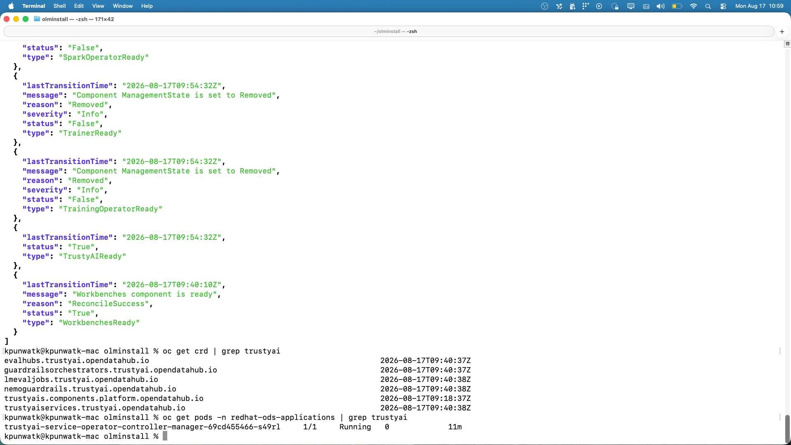
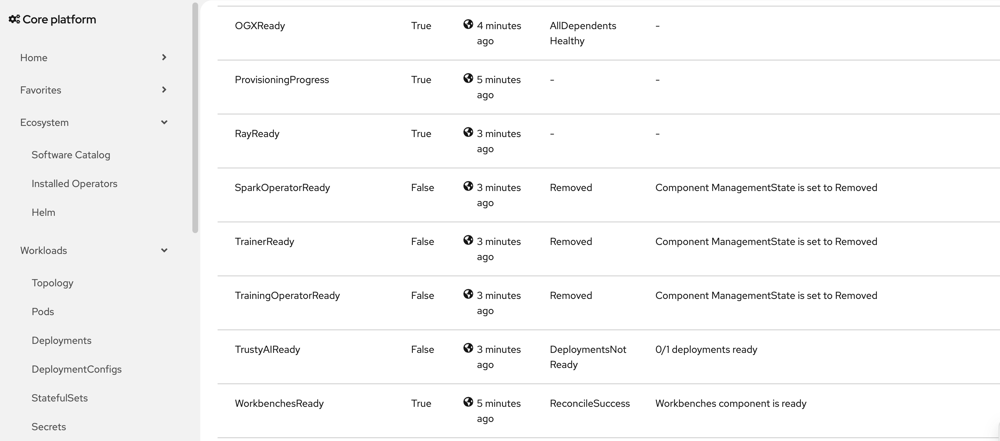

## Agenda

- What is RHOAI & Why Nightly Builds?
- Prerequisites
- Installation Walkthrough (with demos)
- Verifying Deployment & TrustyAI Stability
- Cleanup
- Q&A

## What is RHOAI?

- **Red Hat OpenShift AI** — ML/AI platform on OpenShift
- Components: Dashboard, KServe, TrustyAI, Model Registry, Workbenches
- Managed via **DataScienceCluster (DSC)** custom resource
- Operators installed and managed through **OLM** (Operator Lifecycle Manager)

## Why Nightly Builds?

- Test latest features **before GA release**
- Validate changes early in the development cycle
- CatalogSource points to dev image: `quay.io/rhoai/rhoai-fbc-fragment:rhoai-<release-version>@sha256:<digest>`

## Prerequisites

- OpenShift cluster with **cluster-admin** access
- `oc` CLI installed and logged in
- Clone the install repo:

```bash
git clone https://gitlab.cee.redhat.com/data-hub/olminstall
cd olminstall
```

- Nightly catalog image URL from the build system

## Architecture Overview

```
┌─────────────────────────────────────────────────┐
│              openshift-marketplace               │
│  ┌─────────────────────────────────────────┐    │
│  │  CatalogSource (rhoai-catalog-dev)      │    │
│  └──────────────────┬──────────────────────┘    │
└─────────────────────┼───────────────────────────┘
                      ▼
┌─────────────────────────────────────────────────┐
│            redhat-ods-operator                   │
│  Subscription → InstallPlan → CSV → Operator    │
└──────────────────────┬──────────────────────────┘
                       ▼
┌─────────────────────────────────────────────────┐
│          redhat-ods-applications                 │
│  DataScienceCluster → Components                │
│  (Dashboard, KServe, TrustyAI, ModelRegistry)   │
└─────────────────────────────────────────────────┘
```

## Step 1 — Get the Nightly Image

The `rhoai-devops-bot` posts nightly build images to Slack channel `#rhoai-build-notifications`:

**Slack Channel:**  `#rhoai-build-notifications`

**Bot Message:**

> A new Nightly Build is available for RHOAI v3.5.0
>
> Image: `quay.io/rhoai/rhoai-fbc-fragment:rhoai-<release-version>@sha256:<digest>`
>
> Commit: `a921bd2`

Copy the **Image** URL for the next step.

## Step 1 — Configure CatalogSource {style="font-size: 1.3em;"}

```{.bash style="font-size: 1.2em;"}
./setup.sh -t operator -u stable-<release-version> \
  -i quay.io/rhoai/rhoai-fbc-fragment:rhoai-<release-version>@sha256:<digest>
```

**Output:**

```{style="font-size: 1.1em;"}
namespace/redhat-ods-operator created
catalogsource.operators.coreos.com/rhoai-catalog-dev created
operatorgroup.operators.coreos.com/rhoai-operator-dev created
subscription.operators.coreos.com/rhoai-operator-dev created
```

## Step 1 — Verify Operator in Web Console

**Navigate to:**

- Operators → Installed Operators
- Namespace: `redhat-ods-operator`
- Verify CSV status: **Succeeded**

## Step 1 — Web Console Demo



## Step 2 — Create DataScienceCluster & Verify

- Create DSC via **Web Console**: Operators → Installed Operators → RHOAI → Data Science Cluster → Create
- Or via CLI: `./create-dsc.sh`

Once created, verify:

- DSC reaches **Ready** phase
- All pods in `redhat-ods-applications` are **Running/Completed**

{.r-stretch fig-align="center"}

## Step 3 — Verify TrustyAI

{.r-stretch fig-align="center"}

**TrustyAI is stable when:** `TrustyAIReady: True`, CRDs exist, and pod is **Running**

## TrustyAI Verification Commands

```bash
# Check DSC component conditions
oc get datasciencecluster -o jsonpath='{.items[0].status.conditions}' | jq .

# Verify TrustyAI CRDs are installed
oc get crd | grep trustyai

# Check TrustyAI operator pod is running
oc get pods -n redhat-ods-applications | grep trustyai

# Check DSC and DSCI status
oc get datasciencecluster -A
oc get dsci -A
```

## Cleanup

```bash
# Graceful cleanup
./cleanup.sh -t operator -g

# Complete cleanup with 19-point verification
./complete-cleanup.sh
```

**Handles:** stuck namespaces, CRDs, orphaned webhooks, operator resources

<!--  -->

## Common Issues

| Problem | Solution |
|---------|----------|
| Pods stuck in `Pending` | Check node resources |
| CSV not `Succeeded` | Check InstallPlan approval |
| Namespace stuck `Terminating` | `./remove-stuck-crds.sh` |
| CatalogSource not ready | Check image pull access |

## TrustyAI: DSC Stuck in DeploymentsNotReady

{.r-stretch fig-align="center"}

**Symptom:** DSC shows `DeploymentsNotReady` for TrustyAI even though pods are running

**Root cause:** Image pull secret or ServiceAccount gets regenerated, causing a transient pod failure. The pod self-heals, but `rhods-operator` never re-reconciles — so the DSC shows stale status.

**Fix:**

```bash
oc annotate trustyai default-trustyai \
  opendatahub.io/manual-reconcile=$(date +%s) --overwrite
```

This forces a fresh reconcile → controller sees healthy deployment → flips `TrustyAIReady: True`

## Subscription Channel Mismatch

**Symptom:** Subscription fails to resolve — no InstallPlan created, operator never installs

**Root cause:** The catalog image (e.g., a 3.6 EA build) doesn't publish the channel you specified (e.g., `stable-3.6`). EA/nightly builds often only exist in the `beta` channel.

**Fix:**

```bash
# Patch the subscription to the correct channel
oc patch subscription rhoai-operator-dev -n redhat-ods-operator \
  --type merge -p '{"spec":{"channel":"beta"}}'
```

**Prevention:** Use the correct `-u` flag when running setup:

```bash
# For EA/nightly builds, use beta channel
./setup.sh -t operator -u beta -i <image-url>
```

**Check available channels before installing:**

```bash
oc get packagemanifest rhoai -n openshift-marketplace \
  -o jsonpath='{.status.channels[*].name}'
```

## Q&A

**Resources:**

- Install repo: `olminstall`
- Cleanup guide: `COMPLETE-CLEANUP-README.md`

Thank you!
